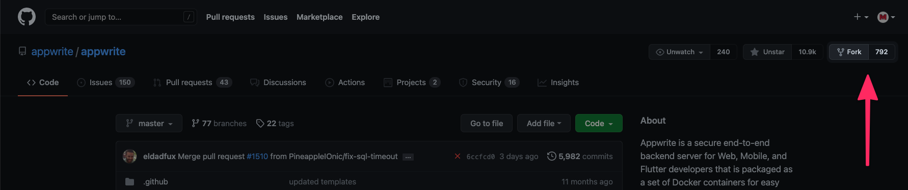

# Help Translate Appwrite to Slovak Language

---

# Introduction

Translating a platform into multiple languages is as important as supporting multiple timezones. We all love to see interfaces we understand, and translation plays a massive role in that.

Your task is to translate the Appwrite console (interface) and emails into **Slovak** language.

### Tasks summary:

- [ ] Fork & clone Appwrite
- [ ] Copy `app/config/locale/translations/en.json` into `app/config/locale/translations/sk.json`
- [ ] Translate all phrases in `sk.json`
- [ ] Add language as supported into `app/config/locale/codes.php`, if not already presented
- [ ] Test the translations _[OPTIONAL]_
- [ ] Push changes and submit pull request

---

# Development setup

It's really easy to contribute to an open-sourced projects, but when using GitHub, there are a few steps we need to follow. This section will take you step-by-step through the process of preparing your own local version of Appwrite, where you can make any changes without affecting Appwrite right away.

_If you are experienced with GitHub or have made a pull request before, you can skip to `Prepare the translations`._

## Fork and clone Appwrite

Before making any changes, you will need to fork Appwrite's repository to keep branches on the official repo clean. To do that, visit the [Appwrite Github repository](https://github.com/appwrite/appwrite) and click on the fork button.



This will redirect you from `github.com/appwrite/appwrite` to `github.com/YOUR_USERNAME/appwrite`, meaning all changes you do are only done inside your repository. Once you are there, click the highlighted `Code` button, copy the URL and clone the repository to your computer using `git clone` command:

```bash
$ git clone COPIED_URL
```

> To fork a repository, you will need a basic understanding of CLI and git-cli binaries installed. If you are a beginner, we recommend you to use `Github Desktop`; it is a really clean and simple visual Git client.

Finally, you will need to create a `feat-XXX-slovak-translation` branch based on the `master` branch and switch to it.

## Prepare the translations

### Copy English, write Slovak

If you enter the folder `app/config/locale/translations`, you will see a list of all currently supported languages. You start by copying one of them, depending on what you want to use as a source language. I would recommend you to always choose `en.json` since this translation has the least mistakes.

After copying your source language (`en.json`), rename the newly created file to `sk.json`, representing language code. Now you open up the file in your favourite text editor and update the translations.

> If you are a beginner, we recommend you to check out `Visual Studio Code`. This is a simple IDE for programmers and can replace programs such as Notepad or Notepad++ with cool autocompletion and colourful syntax highlighting.

### Make sure the language is supported

Open up the `app/config/locale/codes.php` and check if the language is presented. If not, include the language in this list (order by ABC) and use a comment block to explain the language code. There are many languages already included, so you can just copy existing like and update texts.

## Push changes and submit a pull request

First of all, commit the changes with the message `Added Slovak translations` and push it. This will publish a new branch to your forked version of Appwrite. If you visit it at `github.com/YOUR_USERNAME_appwrite`, you will see a new alert saying you are ready to submit a pull request. Follow the steps GitHub provides, and at the end, you will have your pull request submitted.
